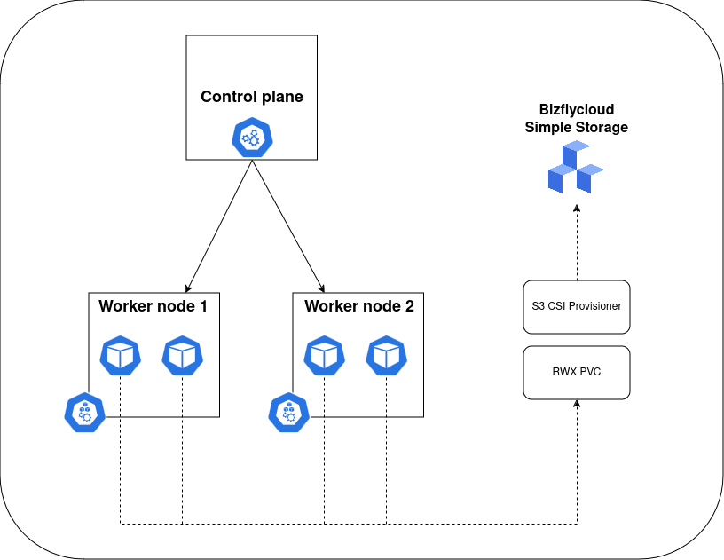
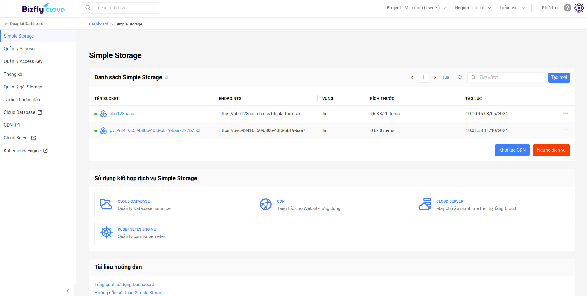
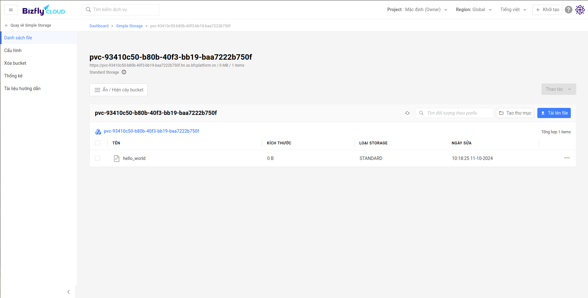

# Giới thiệu k8s-csi-s3

[k8s-csi-s3](https://github.com/yandex-cloud/k8s-csi-s3) cho phép khách hàng sử dụng Bizflycloud Simple Storage bucket làm một storage cho BKE có khả năng ReadWriteMany. csi-s3 sẽ tạo ra mỗi bucket tương ứng với volume, tương ứng với volume id

**Chuẩn bị**

1. Access key [API Access Key](https://manage.bizflycloud.vn/simple-storage/access-key)

**Lưu ý:** Vì S3 Không phải là một file system thực nên có một số giới hạn [giới hạn](https://github.com/yandex-cloud/geesefs#posix-compatibility-matrix)

## Sở đồ k8s-csi-s3

The following diagram shows how k8s-csi-s3 works on a DigitalOcean Kubernetes cluster (DOKS) (based on the example used in the getting started section):




## Hướng dẫn sử dụng

1. Cài đặt add-on csi-s3

2. Cài đặt secret để xác thực k8s-csi-s3 với Bizflycloud Simple Storage

`kubectl apply -f secret.yaml --force`

```yaml
apiVersion: v1
kind: Secret
metadata:
  name: csi-s3-secret
  namespace: csi-s3
stringData:
  accessKeyID: <YOUR_ACCESS_KEY_ID>
  secretAccessKey: <YOUR_SECRET_ACCESS_KEY>
  endpoint: https://hn.ss.bfcplatform.vn
```

### Sử dụng k8s-csi-s3 với pod

#### Triển khai PVC

Tạo một PVC sử dụng storageclass mới vừa tạo. Một Bizflycloud Simple Storage bucket sẽ được tạo khi tạo PV và xóa đi khi PV bị xóa.

`kubectl create -f https://raw.githubusercontent.com/bizflycloud-kubernetes-add-ons/csi-s3/assets/examples/pvc.yaml`

```yaml
apiVersion: v1
kind: PersistentVolumeClaim
metadata:
  name: csi-s3-pvc
  namespace: default
spec:
  accessModes:
  - ReadWriteMany
  resources:
    requests:
      storage: 5Gi
  storageClassName: csi-s3
```

Kiểm tra pvc được tạo với lệnh `kubectl get pvc csi-s3-pvc`

```text
NAME         STATUS   VOLUME                                     CAPACITY   ACCESS MODES   STORAGECLASS   VOLUMEATTRIBUTESCLASS   AGE
csi-s3-pvc   Bound    pvc-93410c50-b80b-40f3-bb19-baa7222b750f   5Gi        RWX            csi-s3         <unset>                 4s
```

Kiểm tra bucket ở Bizflycloud Simple Storage



Kiểm tra CSI S3 provisioner logs `kubectl logs -l app=csi-s3-provisioner -n csi-s3`

```text
Defaulted container "csi-provisioner" out of: csi-provisioner, csi-s3
I1011 03:00:45.719014       1 reflector.go:255] Listing and watching *v1.PersistentVolume from sigs.k8s.io/sig-storage-lib-external-provisioner/v6/controller/controller.go:872
I1011 03:00:45.818906       1 shared_informer.go:270] caches populated
I1011 03:00:45.819736       1 controller.go:887] Started provisioner controller ru.yandex.s3.csi_csi-s3-provisioner-0_2a4bc2ea-52a9-48e8-b8a8-eaa4267938e8!
I1011 03:01:58.740590       1 controller.go:1335] provision "default/csi-s3-pvc" class "csi-s3": started
I1011 03:01:58.740761       1 event.go:282] Event(v1.ObjectReference{Kind:"PersistentVolumeClaim", Namespace:"default", Name:"csi-s3-pvc", UID:"93410c50-b80b-40f3-bb19-baa7222b750f", APIVersion:"v1", ResourceVersion:"2687", FieldPath:""}): type: 'Normal' reason: 'Provisioning' External provisioner is provisioning volume for claim "default/csi-s3-pvc"
I1011 03:01:58.916928       1 controller.go:762] create volume rep: {CapacityBytes:5368709120 VolumeId:pvc-93410c50-b80b-40f3-bb19-baa7222b750f VolumeContext:map[capacity:5368709120 mounter:geesefs options:--memory-limit 1000 --dir-mode 0777 --file-mode 0666] ContentSource:<nil> AccessibleTopology:[] XXX_NoUnkeyedLiteral:{} XXX_unrecognized:[] XXX_sizecache:0}
I1011 03:01:58.916985       1 controller.go:838] successfully created PV pvc-93410c50-b80b-40f3-bb19-baa7222b750f for PVC csi-s3-pvc and csi volume name pvc-93410c50-b80b-40f3-bb19-baa7222b750f
I1011 03:01:58.917013       1 controller.go:1442] provision "default/csi-s3-pvc" class "csi-s3": volume "pvc-93410c50-b80b-40f3-bb19-baa7222b750f" provisioned
I1011 03:01:58.917067       1 controller.go:1459] provision "default/csi-s3-pvc" class "csi-s3": succeeded
I1011 03:01:58.931733       1 event.go:282] Event(v1.ObjectReference{Kind:"PersistentVolumeClaim", Namespace:"default", Name:"csi-s3-pvc", UID:"93410c50-b80b-40f3-bb19-baa7222b750f", APIVersion:"v1", ResourceVersion:"2687", FieldPath:""}): type: 'Normal' reason: 'ProvisioningSucceeded' Successfully provisioned volume pvc-93410c50-b80b-40f3-bb19-baa7222b750f

```

#### Triển khai  Pod

1.  Tạo pod mount vào volume: `kubectl create -f https://raw.githubusercontent.com/bizflycloud-kubernetes-add-ons/csi-s3/assets/examples/pod.yaml`

```yaml
apiVersion: v1
kind: Pod
metadata:
  name: csi-s3-test-nginx
  namespace: default
spec:
  containers:
   - name: csi-s3-test-nginx
     image: nginx
     volumeMounts:
       - mountPath: /usr/share/nginx/html/s3
         name: webroot
  volumes:
   - name: webroot
     persistentVolumeClaim:
       claimName: csi-s3-pvc
       readOnly: false
```

**Kiểm tra mount pod**

1. Truy cập vào pod `kubectl exec -it pod/csi-s3-test-nginx -- bash`

Kiểm tra S3 mount sử dụng command `mount | grep fuse`

```text
pvc-93410c50-b80b-40f3-bb19-baa7222b750f on /usr/share/nginx/html/s3 type fuse.geesefs (rw,nosuid,nodev,relatime,user_id=65534,group_id=0,default_permissions,allow_other)
```

Tạo 1 file trong thư mục mount `touch /usr/share/nginx/html/s3/hello_world`, kiểm tra ở Simple storage sẽ có 1 file `hello_world`



**Xem thêm các cấu hình cho bucket đã tạo: [Additional Configuration](https://github.com/yandex-cloud/k8s-csi-s3/tree/master?tab=readme-ov-file#additional-configuration)**

## Hướng dẫn nâng cấp csi-s3

`helm repo update`
`helm upgrade csi-s3 yandex-s3/csi-s3 --namespace csi-s3`

## Hướng dẫn xóa csi-s3

`helm uninstall csi-s3 --namespace csi-s3`
